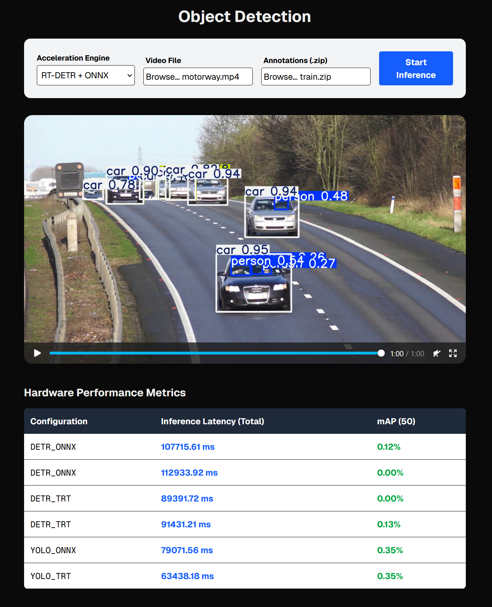

# CMPE-258-Object-Detection

## Inference Optimization

### Backend

The backend server processes the uploaded videos using YOLOv8 or RT-DETR and coordinates precision evaluations.

1. Open a new terminal.
2. Activate your Python virtual environment if you have one.
3. Navigate to the `backend/` directory:
   ```bash
   cd backend
   ```
4. Start the server via `uvicorn`:
   ```bash
   uvicorn main:app --reload
   ```
   _The backend will now be listening on `http://127.0.0.1:8000`._

---

### Frontend

The Next.js frontend displays the UI, processes your uploads, and plots the benchmark tables.

1. Open a second terminal.
2. Navigate to the `frontend/` directory:
   ```bash
   cd frontend
   ```
3. Install the required Node dependencies (if you haven't already):
   ```bash
   npm install
   ```
4. Start the Next.js development server:
   ```bash
   npm run dev
   ```
   _The frontend is now accessible at `http://localhost:3000`._

---

### Test

1. Navigate to `http://localhost:3000` in your browser.
2. **Select an Acceleration Engine**: Choose between `YOLOv8 (TensorRT)`, `YOLOv8 (ONNX)`, `RT-DETR (TensorRT)`, etc.
3. **Upload a Video**: Ensure you select an `.mp4` file for the model to process.
4. **(Optional) Upload Ground Truth Annotations**: If you want to calculate the mAP/Accuracy score, select a `.zip` file containing standard YOLO-format `.txt` files.
   - _Quick Test Feature_: If your zip contains both the `.jpg` frames _and_ the `.txt` labels directly, the backend skips the video extraction step, making testing instantaneous.
5. Click **Start Inference**. The backend natively runs through the file on your accelerator, measures the total millisecond latency, determines the mAP, and streams the finished, bounding-boxed video right back to your UI!

---

### Screenshot

[Original Video Link](https://pixabay.com/videos/cars-motorway-speed-motion-traffic-1900/)



**Why is my mAP lower?** The mAP score is heavily influenced by the labeling density. I opted to label frames sparingly to speed up the workflow. This score shown is not an objective measure of total model capability.
